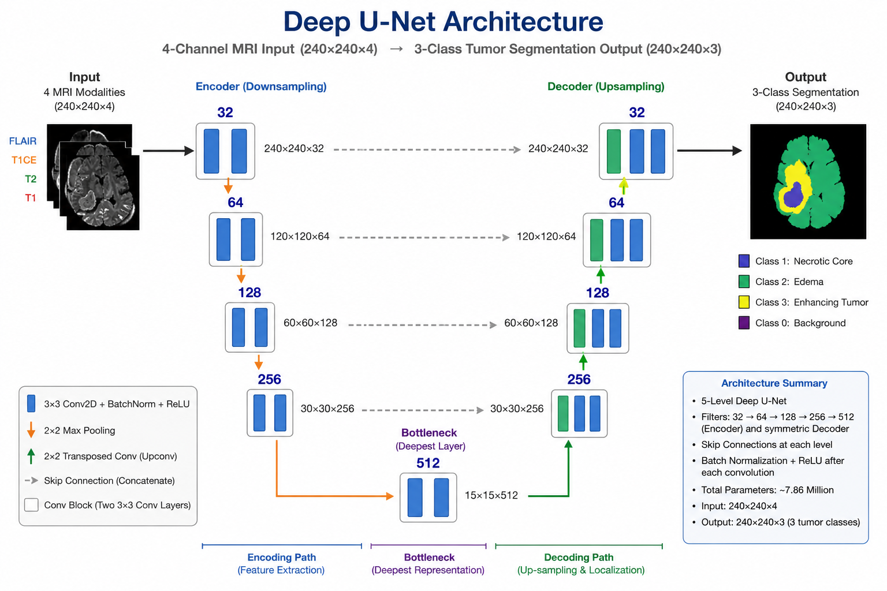
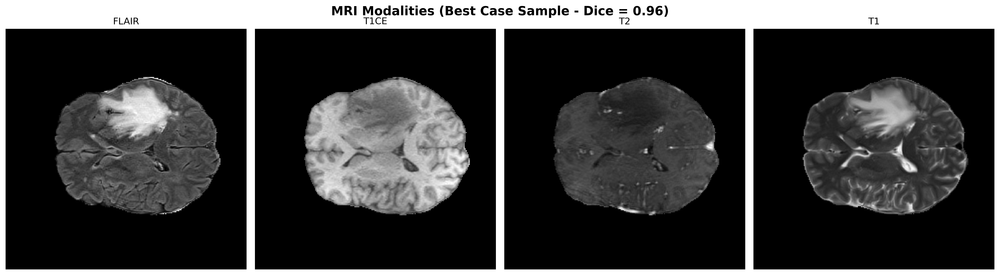
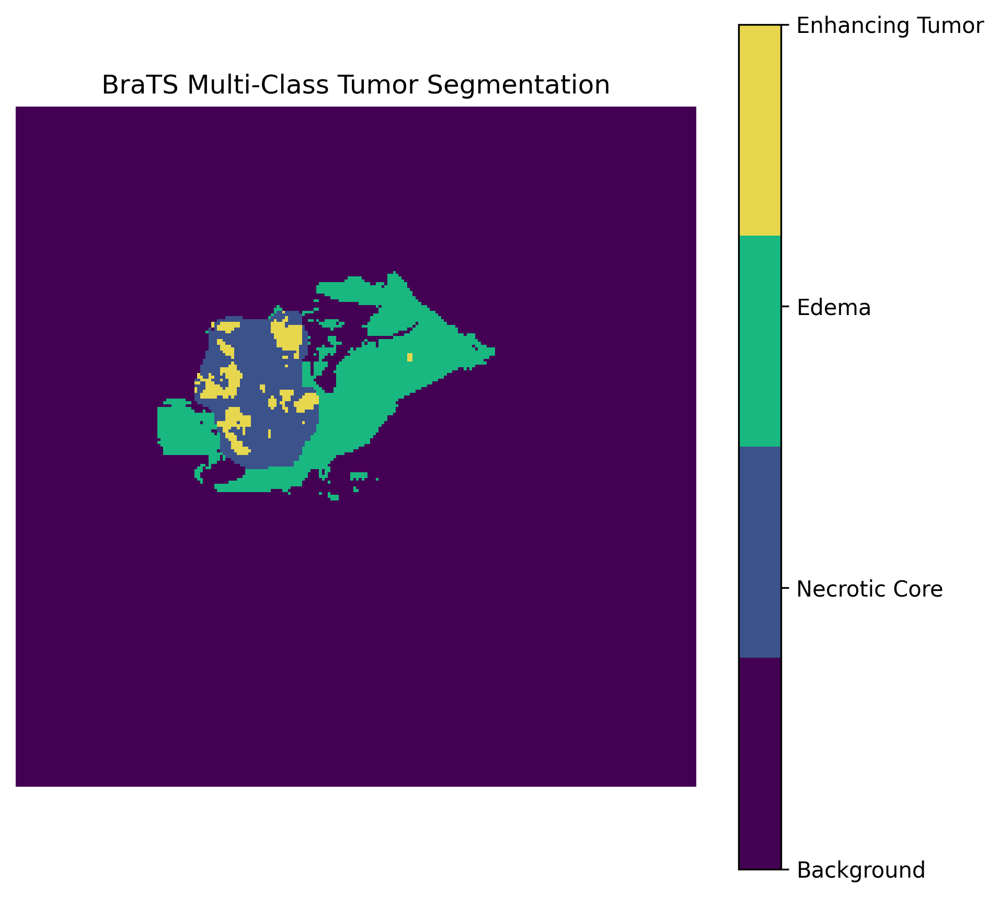
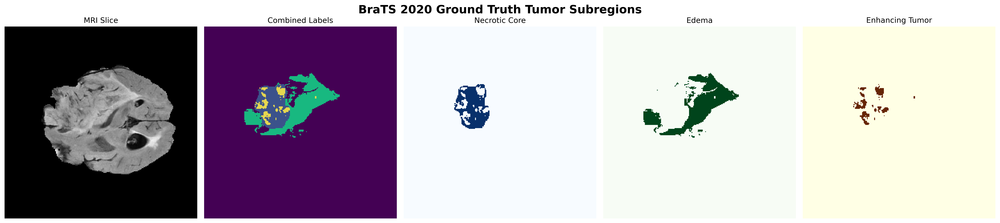
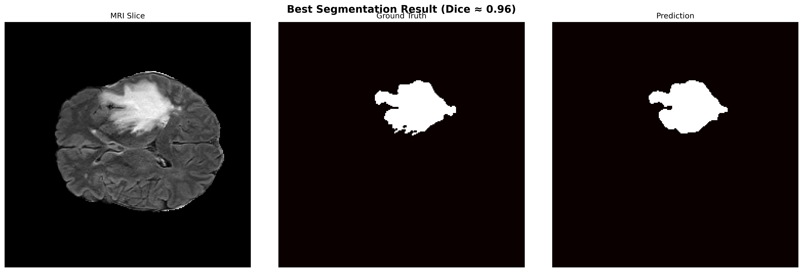
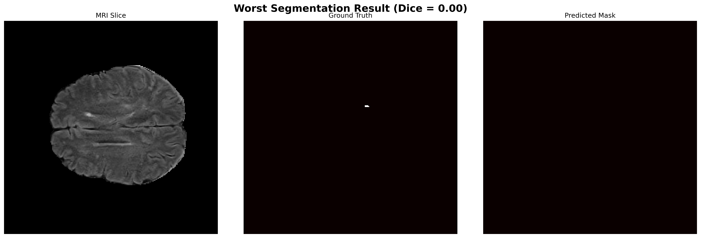
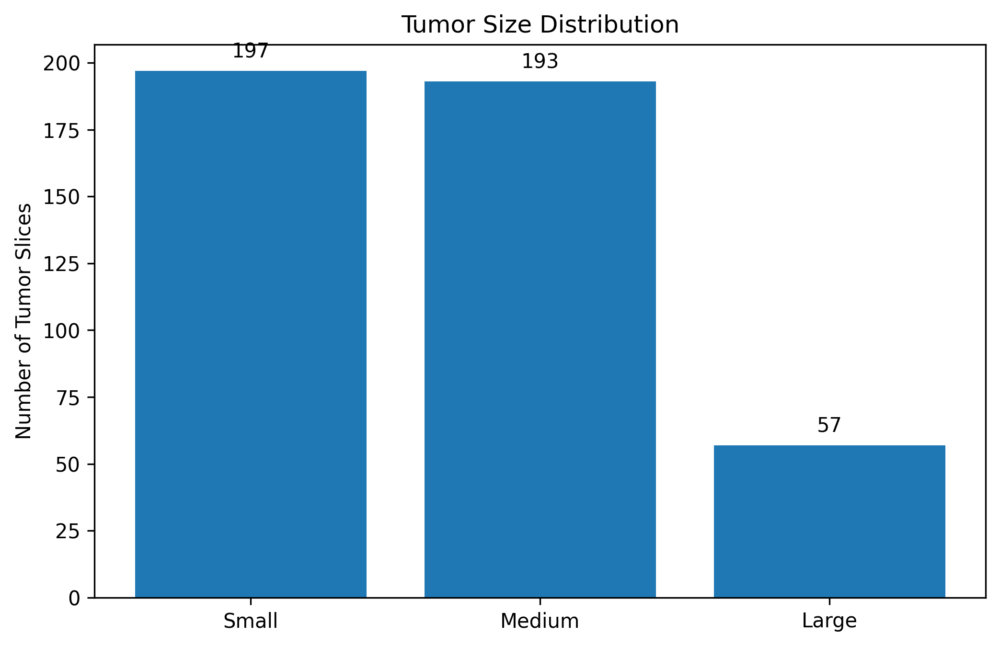
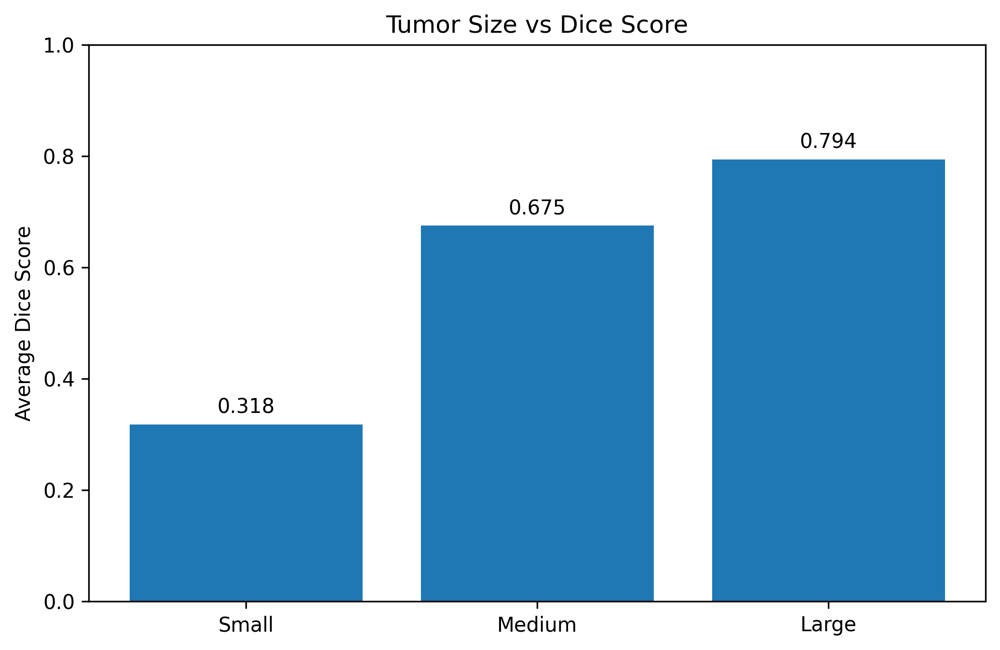

# 🧠 Brain Tumor Segmentation using Deep U-Net

## 📌 Project Overview

Brain tumor segmentation is a critical task in medical image analysis that assists radiologists in identifying and quantifying tumor regions from MRI scans. This project implements a **Deep U-Net architecture** for automatic multi-class brain tumor segmentation using the **BraTS 2020 dataset**.

The model learns to identify different tumor subregions from multi-modal MRI images and generates pixel-wise segmentation masks for accurate tumor localization.

---

## 🎯 Objectives

* Perform automatic brain tumor segmentation from MRI scans.
* Segment multiple tumor subregions.
* Evaluate model performance using Dice Similarity Coefficient (DSC) and Intersection over Union (IoU).
* Analyze segmentation performance across different tumor sizes.
* Visualize best-case and worst-case predictions.

---

## 🗂 Dataset

**Dataset:** BraTS 2020 (Brain Tumor Segmentation Challenge)

### MRI Modalities Used


* T1
* T1CE (T1 Contrast Enhanced)
* T2
* FLAIR

### Segmentation Classes

| Class | Description                    |
| ----- | ------------------------------ |
| 0     | Background                     |
| 1     | Necrotic / Non-Enhancing Tumor |
| 2     | Edema                          |
| 3     | Enhancing Tumor                |

---

## 🏗 Model Architecture
The Deep U-Net architecture used in this project follows an encoder-decoder design with skip connections. The encoder extracts hierarchical features from MRI scans, while the decoder reconstructs precise segmentation masks. Skip connections help preserve spatial information and improve tumor boundary localization.


This project utilizes a **Deep U-Net** architecture consisting of:

* Encoder-Decoder structure
* Skip Connections
* Multi-class Segmentation Output
* Convolution + Batch Normalization Blocks
* Upsampling Layers

The architecture enables precise localization while preserving contextual information from MRI scans.

---

## 📊 Results

### Performance Metrics

| Metric             | Value |
| ------------------ | ----- |
| Average Dice Score | 0.67+ |
| Average IoU        | 0.57+ |
| Best Dice Score    | 0.96  |

---

## 🖼 Visualizations

### MRI Modalities

This figure illustrates the four MRI modalities used in the BraTS 2020 dataset: T1, T1CE, T2, and FLAIR. Each modality highlights different anatomical and pathological characteristics, providing complementary information for accurate tumor segmentation.



### Multi-Class Tumor Labels

The segmentation masks contain multiple tumor classes, including necrotic tumor core, edema, and enhancing tumor regions. Different colors represent different classes, enabling the model to learn detailed tumor structures.



### Tumor Subregions

This visualization demonstrates the major tumor subregions used in brain tumor segmentation. Understanding these regions is essential for evaluating tumor progression, treatment planning, and clinical decision-making.



### Best Case Segmentation

This example represents one of the highest-performing predictions generated by the Deep U-Net model. The predicted mask closely overlaps with the ground truth annotation, resulting in a high Dice Similarity Coefficient (DSC).



### Worst Case Segmentation

This example highlights a challenging MRI slice where the model struggled to accurately segment the tumor region. Such cases help identify limitations of the model and areas for future improvement.



### Tumor Size Distribution

This plot shows the distribution of tumor sizes across the evaluated MRI slices. The analysis provides insight into dataset variability and helps understand how tumor burden influences segmentation performance.



### Tumor Size vs Dice Score

This analysis explores the relationship between tumor size and segmentation accuracy. Larger tumors generally achieve higher Dice scores due to better visibility, while smaller tumors present a more challenging segmentation task.




---

## 📁 Project Structure

```text
Brain-Tumor-Segmentation-DeepUNet
│
├── notebooks/
│   └── Brain_Tumor_Segmentation.ipynb
│
├── images/
│
├── results/
│   └── metrics_summary.csv
│
├── README.md
├── requirements.txt
└── LICENSE
```

---

## ⚙️ Installation

```bash
git clone https://github.com/your-username/Brain-Tumor-Segmentation-DeepUNet.git

cd Brain-Tumor-Segmentation-DeepUNet

pip install -r requirements.txt
```

---

## 🚀 Future Improvements

* Attention U-Net Implementation
* Residual U-Net Architecture
* 3D Brain Tumor Segmentation
* Streamlit Deployment
* FastAPI Deployment
* Clinical Decision Support Integration

---

## 👨‍💻 Author

**Azhar Khan**

M.Tech (Biomedical Engineering)
Indian Institute of Technology Indore (IIT Indore)

---

## 📜 License

This project is released under the MIT License.
